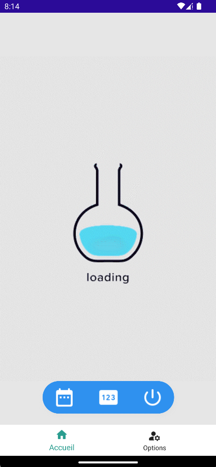
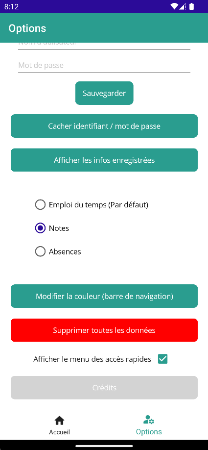
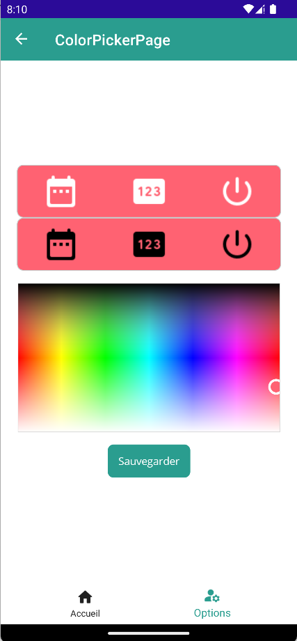

# Odin
This app was made in **.NET MAUI / C#**. It helps students to see their schedule and their marks faster, by **auto-authenticating** them.  
  
Feel free to **contribute** to the project!
  

## 📝 Pages
- **The main page (Home)** contains a WebView, of course, and some buttons to navigate easily. It opens the *default link* stored in *Preferences*, and if there's a username and a password stored in the *SecureStorage*, it logs you in directly to the *default link*.
  
- **The second page (Options)** contains the user-tokens management, where the user can save and show their informations in and from the *SecureStorage*. The user can set a default page to open when the app starts. This value is stored (as previously said) in *Preferences*. You can also change the color of the floating menu, and delete every information saved in the app.

    
    
    

  
  
✨ I hope you'll enjoy this simple yet useful app! ✨

### Coming in future releases :
✔️ *- A button to disconnect yourself and close the app*  
✔️ *- A color picker to change the appearance of the navigation bar!*  
✔️ *- Better UI*  
✔️ *- New loading screen*  
✔️ *- Secrets 👀*
